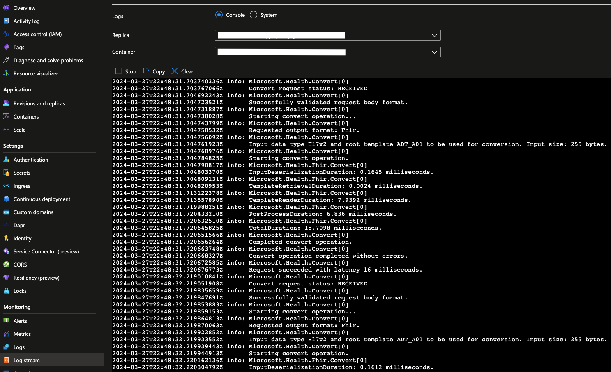

# Monitoring
 
Custom logs and metrics are emitted upon invocation of the converter APIs, that could be used for insights or troubleshooting. Apart from that, Azure Container Apps also emit metrics for insights into the app usage. Here are a few ways to access those.
 
* [Log Stream](https://learn.microsoft.com/azure/container-apps/log-streaming?tabs=bash) - You can view a log stream of your container app's system or console logs from your container app page. The console logs will contain the logs that the hosted Converter image emits.
 
    
 
* [Log Analytics](https://learn.microsoft.com/azure/container-apps/log-monitoring?tabs=bash#query-log-with-log-analytics)
    - You can query system and console logs using the tables listed in the CustomLogs category under the Logs blade. The tables in this category are the ```ContainerAppSystemlogs_CL``` and ```ContainerAppConsoleLogs_CL``` tables.
    - You can query request, metric, and trace logs under the LogManagement category in the Logs blade, under the ```AppRequests```, ```AppMetrics```, and ```AppTraces``` tables, respectively. For more in-depth debugging, each log in the ```AppTraces``` table can be associated to a request in the ```AppRequests``` table through a matching ```OperationId``` value.
 
    
 
    Sample KQL queries for trace and request telemetry:
    ```
    // get the operation_id and result of each request
    AppRequests
    | where TimeGenerated > ago(12hours)
    | project TimeGenerated, Name, ResultCode, OperationId
 
    // get the error details of a failed request
    AppTraces
    | where OperationId == "<enter-operation-id>"
    | where Message contains "Convert operation failed"
 
    // get the latency of each step of the convert operation for a given request
    AppTraces
    | where OperationId == "<enter-operation-id>"
    | where Properties contains "Metric" and Properties contains "Duration"
    | project OperationId, Metric = tostring(Properties.Metric), Latency = tostring(Properties.Duration)
    ```
 
* Convert Metrics - the convert service emits supplemental convert-specific metrics that can be queried through the `AppMetrics` table. Note that Azure Monitor aggregates metrics, so entries in this table cannot each be associated with an individual request - [more info](https://learn.microsoft.com/en-us/azure/azure-monitor/essentials/metrics-aggregation-explained)
 
    Convert Metrics provided:
    - *RequestCount*: total number of API requests made
    - *RequestSucceeded*: total number of successful API requests
    - *RequestFailed*: total number of failed API requests
    - *InputDataByteSize*: size of the InputData in bytes
    - *RequestSuccessLatency*: total latency of a successful API request
    - *RequestFailedLatency*: total latency of a failed API request
    - *InputDataType*: the InputDataType passed in through the request body - this value is found in the "Name" dimension of the metric
    - *OutputDataType*: to requested output data type - this value is found in the "Name" dimension of the metric
    - *RootTemplate*: the RootTemplate name passed in through the request body - this value is found in the "Name" dimension of the metric
    - *ErrorCount*: the total number of errors - exception type is found in the "Name" dimension and error category (either "ClientError" or "ServerError" is found in the "ErrorCategory" dimension)
 
Sample KQL queries for metrics:
 
```
// get the number of total requests, successful requests, and failed requests
AppMetrics
| where TimeGenerated > ago(1hour)
| where Name == "RequestCount" or Name == "RequestSucceeded" or Name == "RequestFailed"
| summarize Count = count() by Name
 
// get the total number of failed requests by exception type, where the error is a client error
AppMetrics
| where TimeGenerated > ago(6hour)
| where tostring(Properties.ErrorCategory) == "ClientError"
| summarize Count = count() by ExceptionType = tostring(Properties.Name)
```
 
* Application Insights - Azure Monitor Application Insights allows you to visualize your convert metrics in graphical format.
 
    * Custom Metrics - convert-specific metrics mentioned above can be viewed in graphical format by selecting the ```azure.applicationinsights``` Metric Namespace when creating graphs in the Metrics blade.
 
    
 
 
* [Built-in Metrics](https://learn.microsoft.com/azure/container-apps/metrics) - Azure Monitor collects metric data from the container app at regular intervals to enable insights into the performance and health of the service. These metrics can be viewed in the "Metrics" blade of your container app.
 
### Telemetry Authentication
The [provided deployment options](deployment-options.md) will by default create a Log Analytics workspace and Application Insights resource for you. They also configure an authentication requirement with the application insights instance so that only telemetry from authorized container apps reaches the application insights instance before being forwarded to the log analytics workspace.